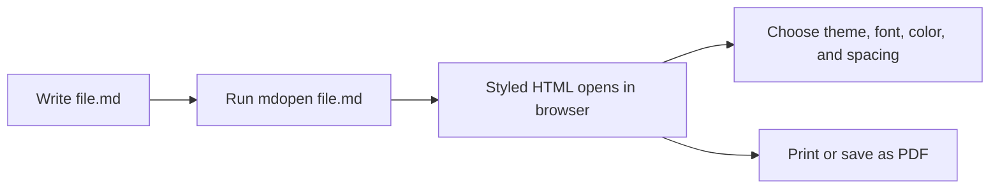

# mdopen

Turn any local Markdown file into a styled browser page with one command.

[View the rendered Markdown demo](demo.html).
[Try the live Mermaid editor](https://rikby.github.io/mdopen/edit.html).

Repository: [github.com/rikby/mdopen](https://github.com/rikby/mdopen)  
Latest release: [github.com/rikby/mdopen/releases/latest](https://github.com/rikby/mdopen/releases/latest)

> **Write Markdown. Run `mdopen`. Read, tune, and print it in your browser.**
>
> `mdopen` is for quick local previews when a plain Markdown file needs to look like a finished document.



## Usage

```bash
mdopen file.md
```

The generated HTML is written to a temporary directory and opened with the platform default browser. No server, project setup, or manual export step is required.

## Features

- GitHub Markdown styling from cdnjs
- Round light / dark icon toggle
- Themes: default, demo, Read the Docs
- Gray levels: default, black, graphite, slate, ash
- Color accents: default, none, blue, sage, rose; each color uses varied heading and block tones
- Font sets: source, system, balanced docs, print serif, technical, editorial, product, mono
- Gap controls: normal, `-1`, `-2`, `-3`
- Mermaid fenced diagram rendering with fullscreen button
- Theme-aware Mermaid diagram surfaces
- Print-specific CSS for tighter output
- `-3` is the most compact print mode

Theme, font, tone, color, and gap are available in the hamburger menu as visible button groups.
The Source font button previews and preserves the selected theme's native heading font.
The pin icon in the menu corner controls whether outside clicks close the hamburger menu.
Default tone and color preserve the selected theme colors.
Select `None` to remove the color accent. Dark mode is for screen reading only; print output stays light.
Print grayscale tones use flat neutral RGB values so near-black text stays clean on color laser printers.

## Requirements

- macOS, Linux, Windows, or MinGW/Git Bash
- `bun`
- installed packages from this package, including `markdown-it` and `highlight.js`

Check:

```bash
bun --version
```

## Architecture

See `ARCHITECTURE.md` for the runtime flow, source layout, and component responsibilities.

## GitHub Pages

The Pages workflow renders `README.md` to `_site/index.html`, renders `examples/demo.md` to `_site/demo.html`, and deploys both from GitHub Actions.

Local preview build:

```bash
bun run build:pages
```

Then open `_site/index.html` or `_site/demo.html`.

In GitHub, set Pages source to **GitHub Actions** under repository settings. Pages deploys on pushes to `main` and can also be run manually from the Pages workflow.

## Install Layout

```text
bin/mdopen.js          cross-platform Bun CLI
bin/mdopen             macOS/Linux/MinGW shell launcher
bin/mdopen.cmd         Windows Command Prompt launcher
bin/mdopen.ps1         PowerShell launcher
renderer.js            Bun + markdown-it + highlight.js renderer
assets/                CSS, theme sources, and font assets
templates/             HTML template source
```

MinGW/Git Bash is supported through the shell launcher. Native Windows shells can use `bin\mdopen.cmd` or `bin\mdopen.ps1`.

## Binary Builds

Standalone binaries are published on the [latest release](https://github.com/rikby/mdopen/releases/latest).

Available release files:

- `mdopen-darwin-x64`
- `mdopen-darwin-arm64`
- `mdopen-linux-x64`
- `mdopen-linux-arm64`
- `mdopen-linux-x64-musl`
- `mdopen-linux-arm64-musl`
- `mdopen-windows-x64.exe`
- `mdopen-windows-arm64.exe`

Build a standalone binary for the current platform:

```bash
bun run build:binary
```

GitHub Actions builds release artifacts for macOS x64/arm64, Linux x64/arm64, Linux musl x64/arm64, and Windows x64/arm64.

See `docs/binaries.md` for binary packaging and release details.
