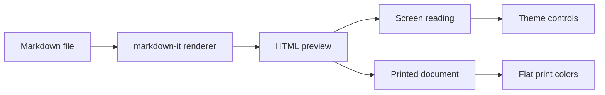

# Markdown HTML Render Demo

> A compact public demo for testing Markdown rendering, screen reading controls, and print output.

---

## What this tests

This page exercises the Markdown features that usually expose renderer and CSS problems:

* Heading hierarchy, paragraphs, links, emphasis, and horizontal rules.
* Ordered, unordered, nested, and task lists.
* Tables with alignment and long cells.
* Code highlighting, inline code, and long code lines.
* Blockquotes, GitHub-style callouts, definition lists, marks, subscript, superscript, Mermaid diagrams, images, and footnotes.
* Screen themes, spacing controls, and print behavior.

## Long code line wrap smoke test

This block starts with one intentionally long line so the code-wrap control can be tested immediately.

```js
const intentionallyLongCodeLineForWrapTesting = "ThisIsAnExtremelyLongUnbrokenCodeTokenDesignedToExposeWhetherCodeBlocksWrapWordsCorrectlyOrForceHorizontalScrollingAtTheBeginningOfTheDemoDocument_BecauseTheFirstVisibleCodeBlockShouldMakeTheWrapBehaviorObviousWithoutScrollingDeepIntoThePage_1234567890ABCDEFGHIJKLMNOPQRSTUVWXYZ";
const shortLine = "The next line is short, so height changes should be easy to notice.";
```

## Design goals

A good rendered Markdown page should feel quiet, readable, and structured. It should not look like a raw technical dump, and it should not depend on decoration to communicate hierarchy.

The same document should work in two modes:

* **Screen reading:** soft contrast, generous spacing, readable line length, subtle color.
* **Print reading:** high contrast, clear hierarchy, minimal ink waste, no reliance on background color.

## Page layout

The main content column should be narrow enough for long reading.

Recommended content width:

* Screen: `680px` to `760px`
* Print: full page width minus margins
* Line length: around `65–80` characters

Margins should be generous. On screen, the page can sit inside a calm background. On paper, the content should print directly without decorative containers.

## Typography

Use a serious, readable typeface. A good system stack is usually enough:

```css
font-family: Inter, ui-sans-serif, system-ui, -apple-system, BlinkMacSystemFont, "Segoe UI", sans-serif;
```

For long-form reading, a serif face can also work well:

```css
font-family: Charter, "Bitstream Charter", "Sitka Text", Cambria, serif;
```

The recommended base size is:

* Screen: `17px` or `18px`
* Print: `11pt` or `12pt`
* Line height: `1.6` on screen, `1.45` on paper

## Heading hierarchy

# Heading level 1

The first-level heading should be reserved for the document title. It should be large, confident, and not overly decorative.

## Heading level 2

Second-level headings divide the document into major sections. They can use a calm accent color on screen.

### Heading level 3

Third-level headings introduce smaller subsections. They should be visibly different from body text but not too loud.

#### Heading level 4

Fourth-level headings are useful inside dense documentation. They should usually stay close to the paragraph below them.

## Recommended colors

Use a restrained palette. The document should remain readable if printed in grayscale.

| Role            |           Screen color | Print behavior          |
| --------------- | ---------------------: | ----------------------- |
| Text            |              `#1F2937` | Black or near-black     |
| Muted text      |              `#6B7280` | Dark gray               |
| Heading         |              `#111827` | Black                   |
| Accent          |              `#2563EB` | Black or dark gray      |
| Link            |              `#1D4ED8` | Underlined              |
| Border          |              `#D1D5DB` | Light gray              |
| Code background |              `#F3F4F6` | Very light gray or none |
| Warning         | `#92400E` on `#FEF3C7` | Border only if needed   |
| Success         | `#065F46` on `#D1FAE5` | Border only if needed   |
| Info            | `#1E40AF` on `#DBEAFE` | Border only if needed   |

Avoid saturated backgrounds for large areas. Use color mostly for hierarchy, links, borders, and small callout accents.

## Renderer controls

The preview toolbar should keep screen reading and print output separate.

| Control | Good default | Print intent |
| ------- | ------------ | ------------ |
| Style   | Demo         | Uses this document's opinionated layout styles |
| Tone    | Default      | Preserves source colors until a gray tone is chosen |
| Color   | Default      | Preserves source colors until an accent set is chosen |
| Font    | Print        | Uses serif body text with sans-serif headings |
| Gap     | Normal       | Keeps comfortable spacing for reading |

Tone choices such as **Black**, **Graphite**, **Slate**, and **Ash** affect the whole document. Color choices vary heading levels, links, borders, and callouts without using heavy fills.

Dark mode is for screen reading only. Printed output should remain light and economical.

## Paragraphs

Paragraphs should have enough spacing to avoid crowding. The spacing should come from margins, not empty lines inserted into the content.

This is a normal paragraph. It should be easy to read for several minutes without fatigue. The line height should feel open, but not loose. The text color should not be pure black on a bright white screen; near-black is usually more comfortable.

A second paragraph follows here. Notice that the page should not need indentation. Modern web documents usually use vertical paragraph spacing instead of first-line indents.

## Emphasis

Markdown supports **bold text**, *italic text*, and ***bold italic text***.

Use bold for strong emphasis, not for decoration. Italic text should be slightly distinct but still readable. Avoid using color alone to communicate meaning.

## Links

A link should look like a link: [example documentation link](https://example.com).

Long URLs should wrap cleanly without forcing horizontal scrolling:
https://example.com/docs/rendering/markdown-html-preview/typography/print-output/very-long-reference-path-with-query-string?theme=demo&density=normal&accent=blue

On screen, color is acceptable. In print, links should usually be underlined, because color may disappear or become ambiguous.

## Lists

Lists should be compact but not cramped.

### Unordered list

* Use clear spacing between list items.
* Keep markers visually quiet.
* Align wrapped lines cleanly.
* Avoid excessive indentation.

### Ordered list

1. Start with the main action.
2. Add only the necessary explanation.
3. Keep related steps close together.
4. Use sublists only when they improve clarity.

### Nested list

* Document layout

  * Content width
  * Margins
  * Print behavior
* Typography

  * Font family
  * Font size
  * Line height
* Color

  * Accent color
  * Link color
  * Callout colors

### Deep nesting

* Document
  * Section
    * Component
      * Detail that wraps onto a second line when the content column is narrow enough to stress indentation, marker spacing, and line height.

## Blockquotes

> Good typography does not ask the reader to notice the design. It removes friction from reading.

A blockquote should be visually distinct without becoming a decorative poster. A left border, slightly muted text, and subtle background are enough.

> **Note:** In printed output, a blockquote should still work if background colors are removed. The left border and spacing should carry the structure.

## Callout blocks

Markdown does not have a universal callout syntax, but many converters support patterns like blockquotes with labels.

> [!NOTE]
> This is an informational note. Use it for context, hints, or secondary explanations.

> [!TIP]
> This is a helpful tip. Use it for practical advice that improves the reader’s workflow.

> [!WARNING]
> This is a warning. Use it for risks, limitations, or things the reader should check carefully.

> [!IMPORTANT]
> This is important information. Use it sparingly so it keeps its weight.

For print, callouts should rely on border style, label text, and spacing rather than background color alone.

## Code

Inline code like `font-size`, `line-height`, and `margin-block` should be slightly highlighted but not visually aggressive.

A code block should use a monospace font, syntax highlighting, and enough padding:

```css
.markdown-body {
  max-width: 720px;
  margin: 0 auto;
  padding: 48px 24px;
  color: #1f2937;
  font-size: 18px;
  line-height: 1.65;
}

.markdown-body h1,
.markdown-body h2,
.markdown-body h3 {
  color: #111827;
  line-height: 1.2;
}

.markdown-body blockquote {
  margin-inline: 0;
  padding: 0.75rem 1rem;
  border-left: 4px solid #2563eb;
  background: #eff6ff;
  color: #374151;
}
```

Printed code blocks should avoid dark backgrounds. They use too much ink and reduce readability.

```js
const printProfile = {
  tone: "graphite",
  color: "default",
  darkMode: false,
  preserveSourceColors: true,
};

function shouldUseFlatBlack(color) {
  return color.role === "text" || color.role === "heading";
}

const longLine = "This deliberately long line checks whether code blocks scroll horizontally instead of breaking the page layout or clipping important content near the right edge of the viewport.";
```

## Extended markdown

Task lists, definition lists, marks, subscript, and superscript should render without extra configuration.

- [x] Render common GitHub-style markdown.
- [x] Keep checked and unchecked tasks aligned.
- [ ] Verify the printed page before sharing it.

Tone
: A whole-document grayscale treatment.

Color
: A separate accent system for headings, links, borders, and callouts.

Highlighting with `==marked text==` should be visible but modest. Chemical notation like H~2~O and references like E = mc^2^ should stay readable.

## Mermaid diagrams

Mermaid diagrams should render in the browser preview, adapt to light or dark reading mode, and print without dark backgrounds.



## Tables

Tables should be readable, but not visually heavy.

| Element      | Screen style                                                        | Print style          |
| ------------ | ------------------------------------------------------------------- | -------------------- |
| `h1`         | Large, dark, strong                                                 | Large, black         |
| `h2`         | Accent color or dark                                                | Black with rule      |
| `p`          | Comfortable line height                                             | Slightly tighter     |
| `blockquote` | Left border + soft background                                      | Left border only     |
| `code`       | Light background with enough padding for long technical identifiers | Border or light gray |
| `a`          | Blue text                                                           | Underlined           |

Avoid zebra stripes unless the table is large. Borders and spacing are usually enough.

## Horizontal rules

A horizontal rule should be subtle. It should separate sections without looking like a hard break.

---

## Images

Images should scale to the content width and avoid overflowing the page.


Image captions should be smaller and muted.

*Figure 1. A sample image caption. Captions should remain readable in print.*

## Footnotes

Footnotes are useful for secondary references or clarifications.[^1]

The main text should remain readable without forcing the reader to jump constantly between body and notes.

[^1]: This is an example footnote. In print, footnotes should use smaller text but still have enough line height.

## Print-specific guidance

When printing, remove anything that only helps the screen version:

* Remove page shadows.
* Remove decorative backgrounds.
* Convert grayscale tones to flat neutral black or dark gray.
* Underline links.
* Avoid page breaks directly after headings.
* Avoid splitting tables, code blocks, and callouts across pages when possible.

Recommended print CSS:

```css
@media print {
  body {
    background: white;
  }

  .markdown-body {
    max-width: none;
    padding: 0;
    color: black;
    font-size: 11.5pt;
    line-height: 1.45;
  }

  .markdown-body a {
    color: black;
    text-decoration: underline;
  }

  .markdown-body h1,
  .markdown-body h2,
  .markdown-body h3 {
    color: black;
    page-break-after: avoid;
    break-after: avoid;
  }

  .markdown-body pre,
  .markdown-body blockquote,
  .markdown-body table {
    break-inside: avoid;
    page-break-inside: avoid;
  }

  .markdown-body blockquote {
    background: transparent;
    border-left: 3pt solid #777;
  }
}
```

## Closing example

A markdown document becomes pleasant to read when the converter respects rhythm: heading spacing, paragraph width, line height, contrast, and predictable visual treatment for special blocks.

The best result is not flashy. It is a page where the reader understands the structure immediately and can keep reading without thinking about the interface.
